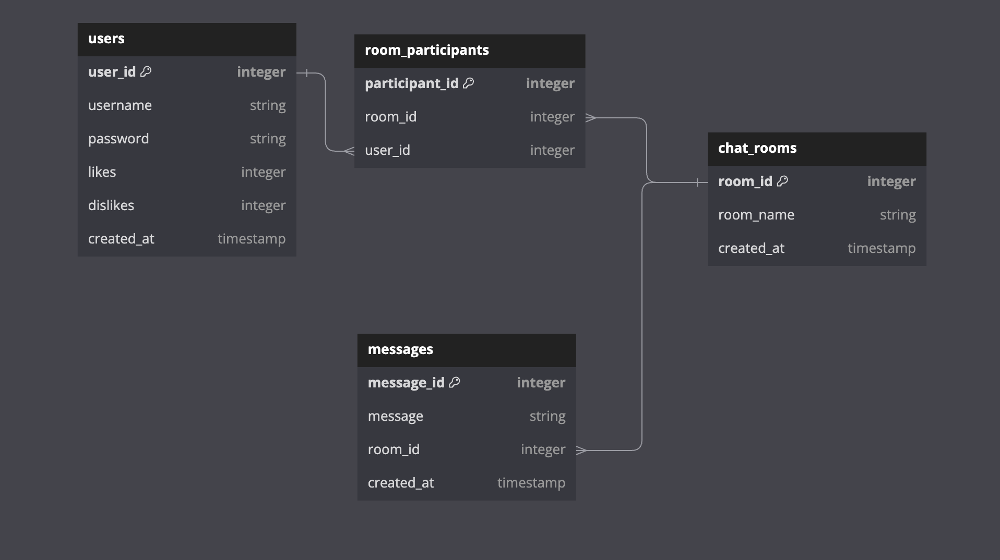

# Phase-5-Project

Amirite

Multi-use messaging/debate platform

Have you ever wanted an actual good messaging app, where it's ok to argue with chronically online people? Welcome to Amirite, where we welcome public discourse!

Core deliverables:

1. Users will be able to login, and have personalized data dedicated to them.
2. Users will be able to chat with other users
3. Users will be able to create public debate rooms

Advanced deliverables:

1. Audio message implementation, via user chats
2. Users are able to add friends
3. Leaderboards and level implementations based off of how many wins a user has

New Technologies:

1. Password hashing
2. Charts

DB Diagram:

KanBan Board:

WireFrame:

